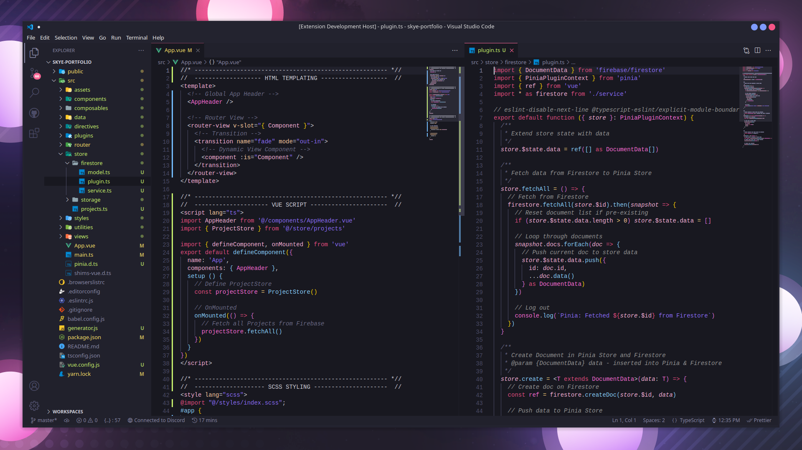

  

<h1 align="center">:cherry_blossom: SKYE Blossom :cherry_blossom:</h1>

A dark yet vibrant cherry flavored VSCode theme

<h1 align="center">:rocket: Installation :rocket:</h1>

1. Open VSCode Extension Panel
2. Search "SKYE"
3. Install SKYE Blossom
4. Open the Command Palette with Ctrl+Shift+P or ⇧⌘P
5. Search and Run "Preferences: Color Theme"
6. Select SKYE Blossom

<h1 align="center">:page_with_curl: License :page_with_curl:</h1>
The entire SKYE Blossom project is provided with the MIT License, including this VSCode Theme.

Designed and Developed with :heart: by Jessica Skye
